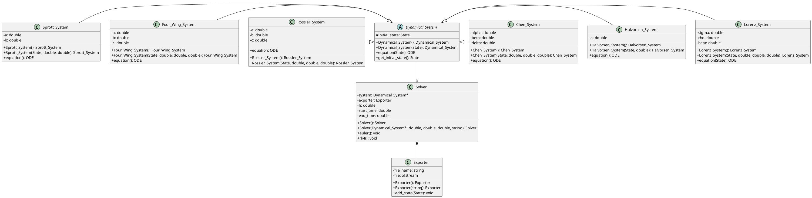
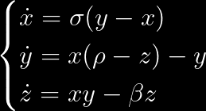

# Dynamical Systems

This is a school project where I show my abilities in object oriented programming for the TC1030 course.

## Features

- **Solve ODEs** numerically (Euler, RK4 methods)
- **Predefined Systems** like Lorenz attractor, Sprott attractor and more
- **Export trajectories** to visualize with Python or on the web

## Installation

1. Clone the repo

```bash
git clone https://github.com/Alex-Benitez16/Dynamical-Systems.git
cd Dynamical-Systems
```

2. Compile (requires **`gcc`**)

```bash
g++ source/*.cpp -Iinclude -std=c++11
```

3. **Run**

```bash
./a.out # Or its equivalent on your platform
```

## Visualization

If you wish to plot the attractor there are two main ways:

1. Execute the `plot.py` Python script

```bash
python output/plot.py
```

> This method requires pandas, matplotlib, and numpy

2. Visualize in the web

    - Open [Plotly Chart](https://chart-studio.plotly.com/create/#/).
    - Import the csv (found in the `/output` folder)
    - Select the `+ Trace` button
    - Under type select 3D line
    - Select the corresponding rows

## UML



## Samples

> Note: All the following attractors use the default parameters with rk4 default method.

### Lorenz Attractor



### Four Wing Attractor


### Halvorsen Attractor


### Rossler Attractor


### Chen Attractor


### Sprott Attractor
